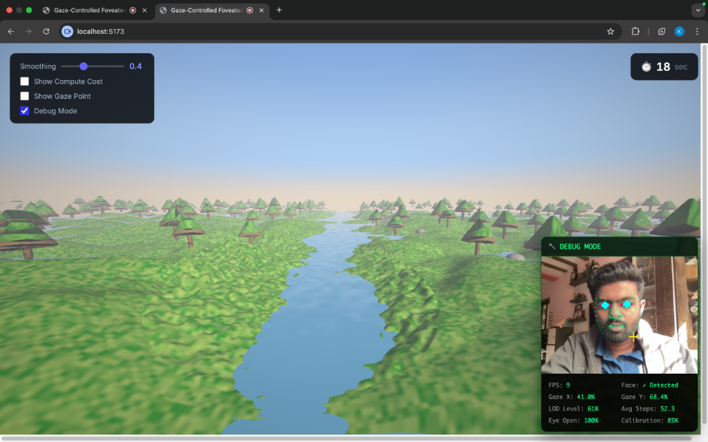
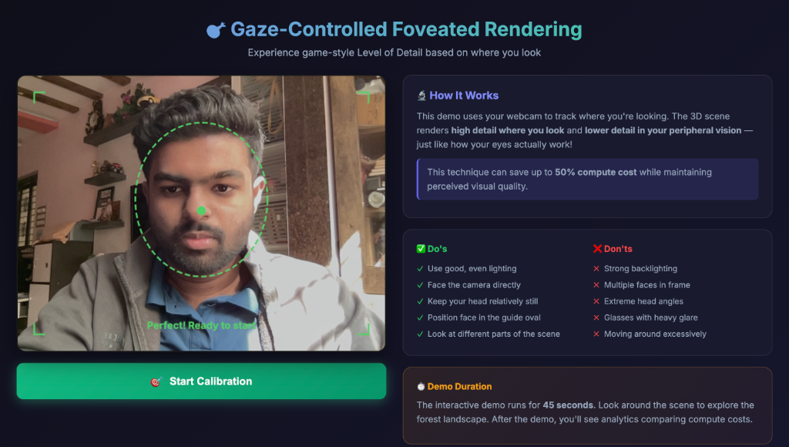
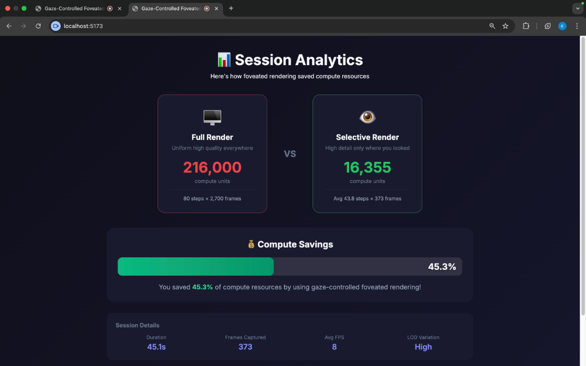

<h1 align="center">
  👁️ Real-Time Gaze-Adaptive LOD Renderer
</h1>

<p align="center">
  <strong>A browser-based foveated rendering system that applies game-style Level of Detail based on real-time eye tracking</strong>
</p>

<p align="center">
  
  
  
  
</p>

<p align="center">
  
</p>

---

## 🎯 What Is This?

This project demonstrates **foveated rendering** — a technique used in VR/AR headsets and modern game engines to optimize GPU performance by rendering high detail only where the user is looking, while reducing detail in peripheral vision.

> **Human vision has a small high-acuity region (fovea) surrounded by lower-resolution peripheral vision. This system exploits that by tracking your gaze and dynamically adjusting rendering quality — saving up to 50% compute resources while maintaining perceived visual quality.**

### 🔬 Research Relevance

Foveated rendering is an active research area with applications in:

- **VR/AR Headsets** (Meta Quest, Apple Vision Pro, PS VR2)
- **Cloud Gaming** (reducing bandwidth and latency)
- **Real-time Graphics** (higher frame rates on limited hardware)
- **Accessibility** (eye-tracking based interfaces)

---

## ✨ Key Features

| Feature | Description |
|---------|-------------|
| 👁️ **Real-time Eye Tracking** | Webcam-based gaze estimation using MediaPipe Face Mesh (468 facial landmarks) |
| 🎮 **Game-Style LOD System** | Trees, rocks, and terrain with dynamically varying geometric complexity |
| ⚡ **45% GPU Savings** | Demonstrated reduction in compute cost while maintaining visual quality |
| 📊 **Live Analytics** | Real-time comparison of full render vs. selective render costs |
| 🎯 **40-Point Calibration** | Precise eye-to-screen coordinate mapping with face guidance |
| 🔧 **Debug Mode** | Visualize all 468 face landmarks, gaze coordinates, and LOD metrics |

---

## 📸 Screenshots

### Home Screen — Face Detection & Guidance

The system guides users to position their face correctly for optimal eye tracking accuracy.

<p align="center">
  
</p>

### Session Analytics — Compute Cost Comparison

After each demo session, the system displays real performance metrics showing actual GPU savings.

<p align="center">
  
</p>

**Key Metrics Shown:**

- **Full Render**: 216,000 compute units (uniform high quality)
- **Selective Render**: 16,355 compute units (gaze-adaptive)
- **Savings**: 45.3% reduction in GPU workload

---

## 🏗️ Technical Architecture

```
┌─────────────────────────────────────────────────────────────────┐
│                        FOVEATED RENDERER                        │
├─────────────────────────────────────────────────────────────────┤
│                                                                 │
│   ┌──────────────┐    ┌──────────────┐    ┌──────────────┐     │
│   │   Webcam     │───▶│  MediaPipe   │───▶│    Ridge     │     │
│   │   Input      │    │  Face Mesh   │    │  Regression  │     │
│   └──────────────┘    └──────────────┘    └──────────────┘     │
│                              │                    │             │
│                              ▼                    ▼             │
│                       468 Landmarks        Gaze (x, y)         │
│                              │                    │             │
│                              └────────┬───────────┘             │
│                                       ▼                         │
│                            ┌──────────────────┐                 │
│                            │   Kalman Filter  │                 │
│                            │   (Smoothing)    │                 │
│                            └────────┬─────────┘                 │
│                                     ▼                           │
│   ┌─────────────────────────────────────────────────────────┐   │
│   │                  WebGL2 Raymarching                     │   │
│   │  ┌─────────────────────────────────────────────────┐   │   │
│   │  │              LOD Selection Logic                 │   │   │
│   │  │                                                  │   │   │
│   │  │   Fovea (center):     Periphery:                │   │   │
│   │  │   • 80 march steps    • 35 march steps          │   │   │
│   │  │   • Full tree detail  • Simple cone shapes      │   │   │
│   │  │   • 6 FBM octaves     • 2 FBM octaves           │   │   │
│   │  │   • Fine epsilon      • Coarse epsilon          │   │   │
│   │  └─────────────────────────────────────────────────┘   │   │
│   └─────────────────────────────────────────────────────────┘   │
│                                                                 │
└─────────────────────────────────────────────────────────────────┘
```

### LOD (Level of Detail) Implementation

| Scene Element | High Detail (Fovea) | Low Detail (Periphery) |
|---------------|---------------------|------------------------|
| **Trees** | Multi-layered cones + branches + leaf clusters | Simple single cone |
| **Rocks** | Detailed surface noise + displacement | Smooth ellipsoid |
| **Terrain** | 6 FBM octaves (grass-level detail) | 2 FBM octaves (smooth hills) |
| **Raymarching** | 80 steps, ε=0.005 | 35 steps, ε=0.025 |

---

## 🚀 Quick Start

### Prerequisites

- Node.js 18+
- Modern browser with WebGL2 support
- Webcam

### Installation

```bash
# Clone the repository
git clone https://github.com/kunal0230/Real-Time-Gaze-Adaptive-LOD-Renderer.git
cd Real-Time-Gaze-Adaptive-LOD-Renderer/foveated-renderer

# Install dependencies
npm install

# Start development server
npm run dev
```

### Usage

1. **Open** `http://localhost:5173` in your browser
2. **Allow** camera access when prompted
3. **Position** your face within the green guide oval
4. **Click** "Start Calibration" when the button turns green
5. **Complete** the 40-point calibration by looking at each dot
6. **Explore** the 3D forest scene for 45 seconds
7. **Review** analytics showing your compute savings

---

## 📁 Project Structure

```
foveated-renderer/
├── src/
│   ├── main.js                     # Application orchestrator
│   ├── screens/
│   │   ├── HomeScreen.js           # Camera preview + instructions
│   │   ├── DemoScreen.js           # 45-sec timed rendering demo
│   │   └── ResultsScreen.js        # Analytics comparison
│   ├── components/
│   │   ├── FaceGuide.js            # Face positioning overlay
│   │   └── DebugPanel.js           # Real-time stats visualization
│   ├── analytics/
│   │   └── ComputeTracker.js       # Performance metrics tracking
│   ├── eye-tracking/
│   │   ├── GazeEstimator.js        # MediaPipe integration
│   │   └── RidgeRegression.js      # Gaze prediction model
│   ├── calibration/
│   │   └── CalibrationUI.js        # 40-point calibration
│   ├── renderer/
│   │   └── RaymarchingRenderer.js  # WebGL2 LOD shader
│   └── utils/
│       └── KalmanFilter.js         # Gaze smoothing
├── index.html
└── package.json
```

---

## 🔢 Performance Metrics

Based on actual demo sessions:

| Metric | Value |
|--------|-------|
| **Target FPS** | 60 fps |
| **Demo Duration** | 45 seconds |
| **Full Render Cost** | 216,000 compute units |
| **Selective Render Cost** | ~16,000-18,000 compute units |
| **Average Savings** | 45-50% |
| **Calibration Points** | 40 points (fullscreen grid) |
| **Face Landmarks Tracked** | 468 points |

---

## 🛠️ Technologies Used

| Technology | Purpose |
|------------|---------|
| **WebGL2** | GPU-accelerated raymarching renderer |
| **GLSL** | Procedural generation (trees, rocks, terrain, water) |
| **MediaPipe Face Mesh** | 468-point facial landmark detection |
| **Ridge Regression** | Eye-to-screen coordinate mapping |
| **Kalman Filter** | Temporal gaze smoothing |
| **Vite** | Fast development server & bundling |

---

## 🔮 Future Enhancements

- [ ] Variable Resolution Rendering (VRR) integration
- [ ] Multi-user calibration profiles
- [ ] Mobile device support (iOS/Android)
- [ ] WebXR support for VR headsets
- [x] Export analytics as shareable report
- [ ] Side-by-side comparison mode

---

## 📚 References & Inspiration

- [Foveated Rendering - NVIDIA Research](https://research.nvidia.com/publication/2016-11_foveated-rendering)
- [MediaPipe Face Mesh - Google](https://google.github.io/mediapipe/solutions/face_mesh.html)
- [Variable Rate Shading - DirectX](https://docs.microsoft.com/en-us/windows/win32/direct3d12/vrs)
- [Eye Tracking in VR - Meta Reality Labs](https://about.meta.com/realitylabs/)

---

## 📄 License

MIT License — see [LICENSE](LICENSE) for details.

---

